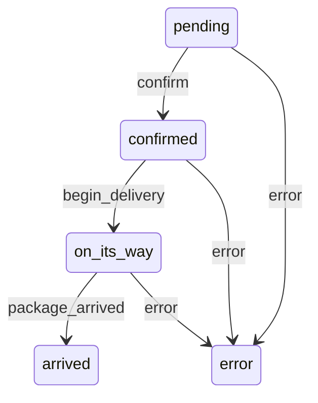

# Charts

Run `mix ash_state_machine.generate_flow_charts` to generate flow charts for your resources. See the task documentation for more. Here is an example:

```mermaid
stateDiagram-v2
pending --> confirmed: confirm
confirmed --> on_its_way: begin_delivery
on_its_way --> arrived: package_arrived
on_its_way --> error: error
confirmed --> error: error
pending --> error: error
```
