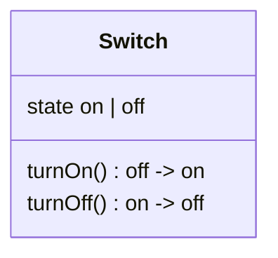

# What is AshStateMachine?

## What is a State Machine?

A state machine is a program who's purpose is to manage an internal "state". The simplest example of a state machine could be a program representing a light switch. A light switch might have two states, "on" and "off". You can transition from "on" to "off", and back.

To build state machines with `Ash.Resource`, we use [`AshStateMachine`](https://hexdocs.pm/ash_state_machine).

When we refer to "state machines" in AshStateMachine, we're referring to a specific type of state machine known as a "Finite State Machine".
It is "finite", because there are a statically known list of states that the machine may be in at any time, just like the `Switch` example above.

### Why should we use state machines?

#### Flexible

State machines are a _simple_ and _powerful_ way to represent complex workflows. They are flexible to modifications over time by adding new states, or new transitions between states.

#### Migrateable

State machines typically contain additional data about the state that they are in, or past states that they have been in, and this state must be migrated over time. When representing data as state machines, it becomes simple to do things like "update all `package` records that are in the `pending_shipment` state".

#### Easy to reason about for humans

State machines, when compared to things like workflows, are easy for people to reason about. We have an intuition for things like "the package is currently `on_its_way`, with a `current_location` of New York, New York", or "your package is now `out_for_delivery` with an ETA of 6PM".

#### Compatible with any storage mechanism

Since state machines are backed by simple state, you can often avoid any fancy workflow runners or complex storage mechanisms. You can store them in a database table, a json blob, a CSV file, at the end of the day its just a `:state` field and accompanying additional fields.

## What does AshStateMachine do differently than other implementations?

AshStateMachine is an [`Ash.Resource`](https://hexdocs.pm/ash/Ash.Resource.html) extension, meaning it _enhances a resource_ with state machine capabilities. In `Ash`, all modifications go through [_actions_](actions.html). In accordance with this, `AshStateMachine` offers a DSL for declaring _valid states and transitions_, but does not, itself, _perform_ those transitions. You will use a change called `transition_state/1` in an action to move from one state to the other. For more, check out the [CookBook](https://hexdocs.pm/ash/readme.html#cookbook)
