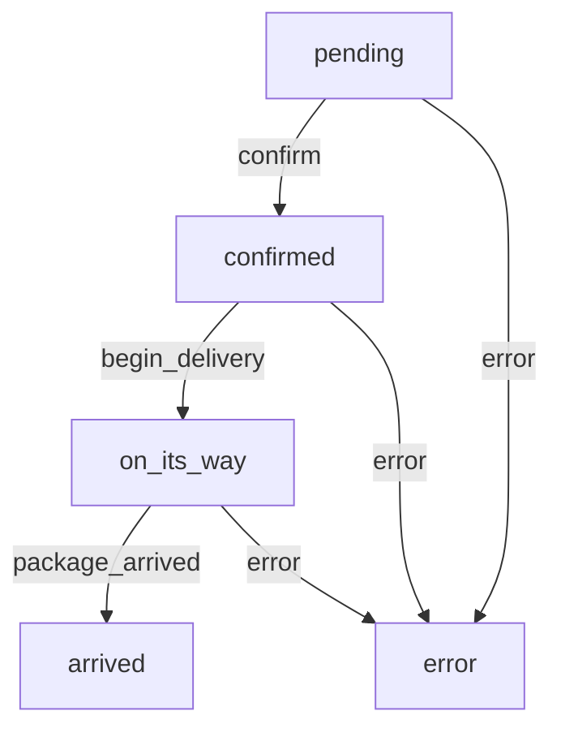

# Getting Started with State Machines

## Get familiar with Ash resources

If you haven't already, read the [Ash Getting Started Guide](https://hexdocs.pm/ash/get-started.html), and familiarize yourself with Ash and Ash resources.

## Bring in the ash_state_machine dependency

```elixir
def deps()
  [
    ...
    {:ash_graphql, "~> 0.1.0"}
  ]
end
```

## Making a resource into a state machine

The concept of a state machine (in this case a "Finite State Machine"), essentially involves a single `state`, with specified transitions between states. For example, you might have an order state machine with states `[:pending, :on_its_way, :delivered]`. However, you can't go from `:pending` to `:delivered` (probably), and so you want to only allow certain transitions in certain circumstances, i.e `:pending -> :on_its_way -> :delivered`.

This extension's goal is to help you write clear and clean state machines, with all of the extensibility and power of Ash resources and actions.


## A basic state machine

```elixir
defmodule Order do
  # leaving out data layer configuration for brevity
  use Ash.Resource,
    extensions: [AshStateMachine]

  state_machine do
    initial_states [:pending]
    default_initial_state :pending

    transitions do
      transition :confirm, from: :pending, to: :confirmed
      transition :begin_delivery, from: :confirmed, to: :on_its_way
      transition :package_arrived, from: :on_its_way, to: :arrived
      transition :error, from: [:pending, :confirmed, :on_its_way], to: :error
    end
  end

  actions do
    # create sets the state
    defaults [:create, :read]

    update :confirm do
      # accept [...] 
      # you can change other attributes
      # or do anything else an action can normally do
      # this transition will be validated according to
      # the state machine rules above
      change transition_state(:confirmed)
    end

    update :begin_delivery do
      # accept [...]
      change transition_state(:on_its_way)
    end

    update :package_arrived do
      # accept [...]
      change transition_state(:arrived)
    end

    update :error do
      accept [:error_state, :error]
      change transition_state(:error)
    end
  end

  changes do
    # any failures should be captured and transitioned to the error state
    change after_transaction(fn
              changeset, {:ok, result} ->
                {:ok, result}

              changeset, {:error, error} ->
                message = Exception.message(error)

                changeset.data
                |> Ash.Changeset.for_update(:error, %{
                  message: message,
                  error_state: changeset.data.state
                })
                |> Api.update()
            end),
            on: [:update]
  end

  attributes do
    uuid_primary_key :id
    # ...attributes like address/delivery options would go here
    attribute :error, :string
    attribute :error_state, :string
    # :state attribute is added for you by `state_machine`
    # however, you can add it yourself, and you will be guided by
    # compile errors on what states need to be allowed by your type.
  end
end
```

## Generating Flow Charts

run `mix ash_state_machine.generate_flow_charts` to generate flow charts for your resources. See the task documentation for more. Here is a chart generated from the example above:



## Learning more

- Check out the DSL  documentation in `AshStateMachine`

